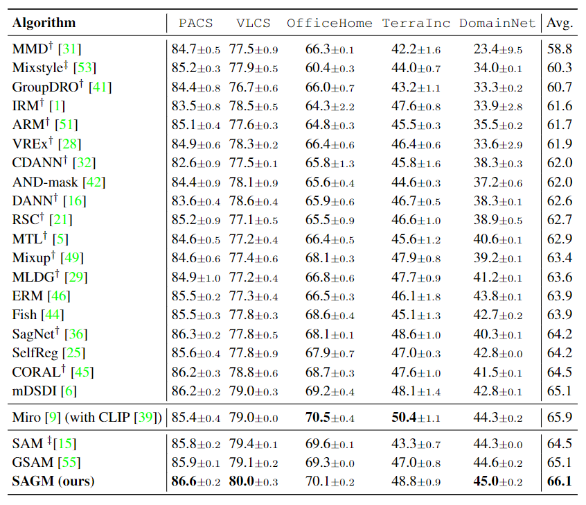
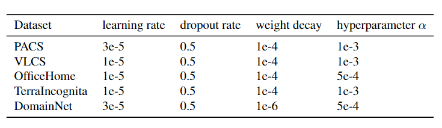

# SAGM
The official codes of our CVPR2023 paper: Sharpness-Aware Gradient Matching for Domain Generalization


Note that this project is built upon [DomainBed@3fe9d7](https://github.com/facebookresearch/DomainBed/tree/3fe9d7bb4bc14777a42b3a9be8dd887e709ec414).


## Preparation

### Dependencies

```sh
pip install -r requirements.txt
```

### Datasets

```sh
python -m domainbed.scripts.download --data_dir=/my/datasets/path
```

### Environments

Environment details used for our study.

```
Python: 3.8.13
PyTorch: 1.12.1
Torchvision: 0.13.1
CUDA: 11.3
```

## How to Run

`train_all.py` script conducts multiple leave-one-out cross-validations for all target domain.

```sh
python train_all.py exp_name --dataset PACS --data_dir /my/datasets/path --trial_seed 0 --algorithm SAGM_DG --checkpoint_freq 100 --alpha 0.001 --lr 3e-5 --weight_decay 1e-4 --resnet_dropout 0.5 --swad False

``` 

Experiment results are reported as a table. In the table, the row `iid` indicates out-of-domain accuracy from SAGM.

Example results:
```
+------------+--------------+---------+---------+---------+---------+
| Selection  | art_painting | cartoon |  photo  |  sketch |   Avg.  |
+------------+--------------+---------+---------+---------+---------+
|   oracle   |   87.919%    | 83.209% | 98.278% | 85.305% | 88.678% |
|    iid     |   88.896%    | 80.704% | 97.605% | 80.471% | 86.919% |
|    last    |   84.991%    | 81.397% | 96.482% | 73.187% | 84.014% |
| last (inD) |   96.902%    | 97.476% | 97.213% | 96.275% | 96.967% |
| iid (inD)  |   98.139%    | 97.521% | 97.586% | 97.911% | 97.789% |
+------------+--------------+---------+---------+---------+---------+

```
In this example, the DG performance of SAGM for PACS dataset is 86.919%.

### Reproduce the results of the paper

We provide the instructions to reproduce the main results of the paper, Table 1 and 2.
Note that the difference in a detailed environment or uncontrolled randomness may bring a little different result from the paper.

- PACS

```
python train_all.py PACS0 --dataset PACS --data_dir /my/datasets/path --deterministic --trial_seed 0 --algorithm SAGM_DG --checkpoint_freq 100 --alpha 0.001 --lr 3e-5 --weight_decay 1e-4 --resnet_dropout 0.5 --swad False
```

- VLCS

```
python train_all.py VLCS0 --dataset VLCS --data_dir /my/datasets/path --deterministic --trial_seed 0 --algorithm SAGM_DG --checkpoint_freq 100 --alpha 0.001 --lr 1e-5 --weight_decay 1e-4 --resnet_dropout 0.5 --swad False
```

- OfficeHome

```
python train_all.py OH0 --dataset OfficeHome --data_dir /my/datasets/path --deterministic --trial_seed 0 --algorithm SAGM_DG --checkpoint_freq 100 --alpha 0.0005 --lr 1e-5 --weight_decay 1e-4 --resnet_dropout 0.5 --swad False
```

- TerraIncognita

```
python train_all.py TR0 --dataset TerraIncognita --data_dir /my/datasets/path --deterministic --trial_seed 0 --algorithm SAGM_DG --checkpoint_freq 100 --alpha 0.001 --lr 1e-5 --weight_decay 1e-4 --resnet_dropout 0.5 --swad False
```

- DomainNet

```
python train_all.py DN0 --dataset DomainNet --data_dir /my/datasets/path --deterministic --trial_seed 0 --algorithm SAGM_DG --checkpoint_freq 100 --alpha 0.0005 --lr 3e-5 --weight_decay 1e-6 --resnet_dropout 0.5 --swad False
```


## Main Results

<p align="center">
    
</p>

## Our searched HPs

<p align="center">
    
</p>

## Citation

The paper will be published at CVPR 2023.

```
@inproceedings{cha2021swad,
  title={SWAD: Domain Generalization by Seeking Flat Minima},
  author={Cha, Junbum and Chun, Sanghyuk and Lee, Kyungjae and Cho, Han-Cheol and Park, Seunghyun and Lee, Yunsung and Park, Sungrae},
  booktitle={Advances in Neural Information Processing Systems (NeurIPS)},
  year={2021}
}
```

## License

This source code is released under the MIT license, included [here](./LICENSE).

This project includes some code from [DomainBed](https://github.com/facebookresearch/DomainBed/tree/3fe9d7bb4bc14777a42b3a9be8dd887e709ec414), also MIT licensed.

